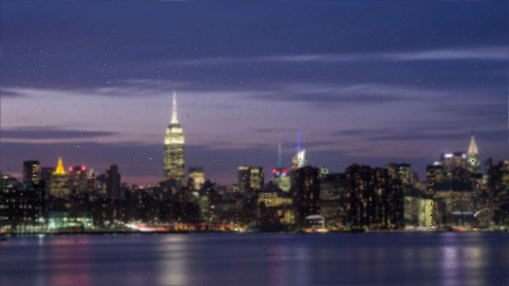

## RainyDay Screensaver

RainyDay is a Windows screensaver inspired by [RainyDay.js](https://github.com/mubaidr/rainyday.js) by [Muhammad Ubaid Raza](https://github.com/mubaidr).

It is written in Rust and OpenGL.

Background photo by [Antoine Meillet](https://unsplash.com/@antoinem?utm_source=unsplash&amp;utm_medium=referral&amp;utm_content=creditCopyText) on [Unsplash](https://unsplash.com/?utm_source=unsplash&amp;utm_medium=referral&amp;utm_content=creditCopyText).

### Video

## Install

1. Download **rainyday.zip** from the [latest release](https://github.com/GeReV/rainyday/releases/latest).
1. Extract **rainyday.zip** into a directory of your choosing, e.g. `C:\rainyday`.
1. In that directory, right click **rainyday.scr** and click "Install" in the popup menu.
1. (Optional) In the _Screen Saver Settings_ window which has now popped up, click _Settings_ and choose your own background.
